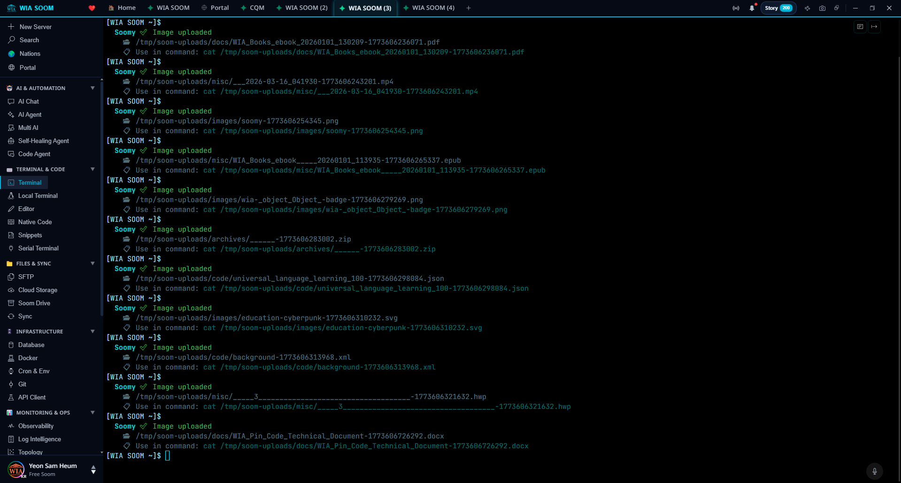
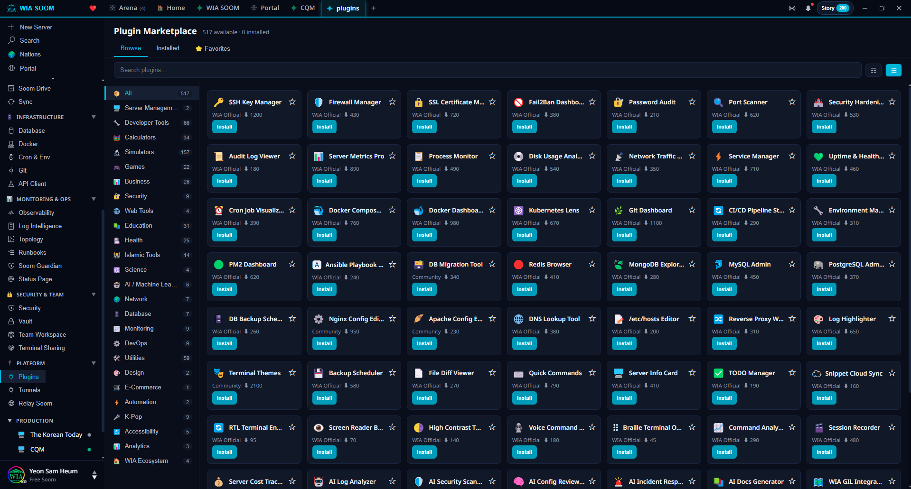
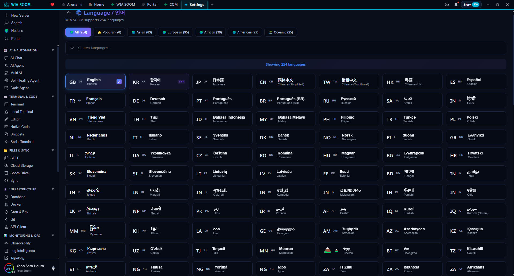

<p align="center">
  <a href="docs/readme/README.zh-CN.md"><strong>🇨🇳 简体中文版</strong></a> ·
  <a href="docs/readme/README.ko.md"><strong>🇰🇷 한국어</strong></a> ·
  <a href="docs/readme/README.ja.md"><strong>🇯🇵 日本語</strong></a> ·
  <a href="docs/readme/">All 255 Languages →</a>
</p>

<p align="center">
  
</p>

<h1 align="center">WIA SOOM</h1>
<p align="center"><strong>The World's First Multimodal AI Terminal</strong></p>
<p align="center">
SSH Terminal + AI Agent + Code Editor + SFTP + Observability<br>
All in one app. Free. 254 Languages.
</p>

<p align="center">
  <a href="https://github.com/WIA-Official/wiasoom.com/releases/latest"></a>
  
  
  
  
</p>

<p align="center"><em>SUI (Soom User Interface) — Breathe life in, AI comes alive.</em></p>

<p align="center">
  <a href="#download">Download</a> · <a href="https://wiasoom.com">Website</a> · <a href="#-whats-never-been-done-before">What's New</a> · <a href="#features">Features</a> · <a href="#pricing">Pricing</a>
</p>

<p align="center">
  🌐 <strong>Read in your language:</strong>
  <a href="docs/readme/README.ko.md">한국어</a> · <a href="docs/readme/README.ar.md">العربية</a> · <a href="docs/readme/README.es.md">Español</a> · <a href="docs/readme/README.fr.md">Français</a> · <a href="docs/readme/README.de.md">Deutsch</a> · <a href="docs/readme/README.ja.md">日本語</a> · <a href="docs/readme/README.zh-CN.md">简体中文</a> · <a href="docs/readme/README.hi.md">हिन्दी</a> · <a href="docs/readme/README.pt-BR.md">Português</a> · <a href="docs/readme/README.sw.md">Kiswahili</a> · <a href="docs/readme/README.bn.md">বাংলা</a> · <a href="docs/readme/README.braille.md">⠺⠊⠁ ⠎⠕⠕⠍ (Braille)</a> · <a href="docs/readme/">All 255 Languages →</a>
</p>

<p align="center">
  <a href="https://youtu.be/Rv_bSDcHVJo">
    
  </a>
</p>

<p align="center">
  <em>"I didn't know the word 'multimodal.' I just wanted my AI to see what I see."</em><br>
  <sub>— Yeon Sam-heum, Creator of WIA SOOM</sub>
</p>

---

## Screenshots

<p align="center">
  <br>
  <em>World's first: drag & drop images, files, and videos directly into your SSH terminal</em>
</p>

<p align="center">
  <br>
  <em>517 plugins — one-click install from the built-in marketplace</em>
</p>

<p align="center">
  <br>
  <em>254 languages — every language, every script, RTL support</em>
</p>

---

## 🔥 What's Never Been Done Before

### 1. Image, File & Video Upload in SSH Terminal — World's First

No CLI client on Earth lets you do this. We built it.

Paste a screenshot of an error into your SSH terminal. Drag a log file. Drop a video of a failing deployment. The AI sees it, analyzes it, and tells you what's wrong — all inside the terminal session.

- **Ctrl+Shift+V** — paste screenshots directly into terminal
- **Drag & Drop** — drop images, files, videos into the terminal
- **Video keyframe extraction** — ffmpeg analyzes video frame by frame
- **All 3 AI providers** — GPT-4o Vision, Gemini Vision, Claude Vision

This feature has never existed in any terminal client — anywhere.

### 2. Terminal Shortcuts That Don't Exist Anywhere Else

Small things that save you thousands of keystrokes a day:

- **Ctrl+Shift+Z** — Undo paste. Pasted a wrong command? Undo it before hitting Enter.
- **Ctrl+Shift+S** — Screenshot terminal. Capture the entire terminal screen to clipboard.
- **Ctrl+Shift+A** — Copy last output. Grab just the result of the last command — no mouse dragging.
- **Ctrl+Shift+E** — Re-edit command. Open the last command in a GUI editor, fix it, run it.
- **Drag = Copy** — Select any text and it's instantly in your clipboard. No Ctrl+C needed.

These don't exist in any other SSH client, terminal emulator, or CLI tool.

### 3. AI Arena — Multi-Agent Battle

2 to 4 AIs solve the same problem simultaneously — not just chatting, but actually editing code on your server. Each AI works in its own isolated Git branch. Compare their results side by side. Pick the winner. The rest get cleaned up.

Cross-review: each AI scores every other AI's solution.

No other tool does this.

### 4. AI Self-Healing Agent

Your server's CPU is spiking. Disk is full. A service crashed at 3 AM. You're asleep.

WIA SOOM's AI agent detects the problem, diagnoses the root cause, generates a fix plan, asks for your approval (or auto-executes if you've set it to), and resolves the issue. 5-level autonomous loop — from observe-only to full auto-repair.

### 5. One App Replaces 8 Paid Tools

| What you'd pay for | WIA SOOM does it | Price |
|---|---|---|
| Datadog / Grafana | Real-time observability + AI prediction | **Free** |
| Splunk / ELK | AI log analysis + anomaly detection | **Free** |
| PagerDuty SRE Agent | AI runbook automation + auto-rollback | **Free** |
| Qualys / CrowdStrike | Security command center + 7-area scan | **Free** |
| Portainer / Dockge | Docker manager via SSH — zero agent | **Free** |
| Teleport / Boundary | Team workspace + RBAC + audit logs | **Free** |
| Postman / Bruno | Built-in API client (REST/GraphQL/WS) | **Free** |
| crontab.guru / Doppler | Visual cron editor + .env manager | **Free** |

### 6. This README Exists in 255 Versions

254 languages + WIA Braille (7,000-language universal Braille, IPA-based). Including indigenous and minority languages. Because every developer on Earth deserves to read about their tools in their own language.

---

## Try Everything Free — 33 Trials

No credit card. No signup required. Just download and start.

Every premium feature — image upload, AI Arena, AI Council, file & video analysis — is free for your first 33 uses. After that, bring your own API key (BYOK) and keep using everything for free. Or subscribe from $3/mo for managed AI and team features.

Why 33? In 1919, Korea's independence movement was led by 33 representatives who declared freedom for all. WIA SOOM's 33 free trials is our declaration: **AI tools should be free for everyone to experience.**

**CLI → GUI → SUI.** Command-line interfaces gave us power. Graphical interfaces gave us ease. WIA SOOM introduces **SUI (Soom User Interface)** — breathe life in, and AI comes alive.

## 5-in-1 Platform

Other tools do one thing. WIA SOOM does five — in one window.

```
┌──────────────────────────────────────────────────────┐
│ WIA SOOM                                              │
├──────┬──────┬──────┬──────┬──────────────────────────┤
│  SSH │  AI  │ Code │ SFTP │ Observability             │
│  Ter │ Agen │ Edit │ File │ Monitor + Security        │
│  min │   t  │  or  │ Mgr  │ + Logs + Topology         │
│  al  │      │      │      │                           │
└──────┴──────┴──────┴──────┴──────────────────────────┘
```

1. **SSH Terminal** — xterm.js, bastion tunneling, split views, multiplayer sharing
2. **AI Agent** — 14 tools, 3 providers (GPT/Gemini/Claude), streaming, image analysis
3. **Code Editor** — Monaco with AI completion, bug detection, deployment
4. **SFTP Manager** — drag-and-drop file management, remote editing
5. **Observability** — real-time metrics, log analysis, topology map, security scan

---

## Features

### AI That Actually Works on Your Server

**AI DevOps Agent** — Type `gpt`, `gemini`, or `claude` in terminal. The AI has 14 tools: read/write/edit files, execute commands, git, grep, process management. Streaming responses. Session memory. It doesn't just suggest — it does.

**AI Arena** — Type `arena`. 2–4 AIs compete in parallel on isolated Git branches. Cross-review scores each solution. Select the winner and merge.

**AI Council** — Multiple AIs discuss your question, then synthesize the best answer.

**AI Code Editor** — Monaco editor with AI-powered completion, bug detection, one-click deployment to server.

**AI Self-Healing** — CPU spike, disk full, service down — AI detects, diagnoses, fixes. 5-level autonomous loop.

**Voice Interface** — Speak commands, hear responses. Hands-free server management.

### Multimodal Upload (World's First in CLI)

Paste images, drag files, drop videos — directly into your SSH terminal session. AI analyzes everything: error screenshots, config files, deployment videos, architecture diagrams.

### Infrastructure Intelligence

**Topology Map** — Visualize servers, services, and connections at a glance. Auto-discovery via SSH — zero agent installation.

**Real-Time Observability** — CPU, memory, disk, network sparkline graphs + AI prediction + auto-recovery. Replaces Datadog.

**AI Log Analysis** — Real-time streaming + anomaly detection + natural language search + cross-server correlation. Replaces Splunk.

### Security & DevOps

**Security Command Center** — 7-area scan + security score + one-click fix + AI analysis + real-time command security gate. Replaces Qualys.

**Docker Manager** — Full Docker management via SSH — zero agent. Container control, live resources, AI log analysis, Compose editor. Replaces Portainer.

**Runbook Automation** — AI executes runbooks automatically. Natural language creation, conditional branching, auto-rollback. Living Runbook that gets smarter. Replaces PagerDuty.

**Cron & Env Manager** — Visual crontab editor + .env file management. AI converts natural language to cron expressions.

### Security & Privacy

**Soom Shield (Secret Redaction)** — Automatic detection and masking of API keys, passwords, tokens, private keys, and environment variables in terminal output. Categories can be toggled individually. Secrets are also masked before sending to AI and in shared sessions. Secure by default — enabled out of the box.

### Productivity

**Soom Summon (Quake Mode)** — Press `Ctrl+`` to summon a terminal from any screen edge. 4-direction support (top/bottom/left/right), multi-monitor aware, configurable size and opacity, auto-hide on focus loss.

**Soom Block (Block Output)** — Terminal output grouped into blocks per command. Each block shows execution time, exit code, and status. Copy output, filter within blocks, bookmark important results, and send blocks to AI for analysis. Inspired by Warp — but works over SSH without shell integration.

**Soom Share (Block Permalink)** — Share any terminal block as a permalink. Configurable expiry (1h/24h/7d/permanent), optional password protection, view count limits, and automatic secret redaction.

### Collaboration

**Multiplayer Terminal** — Share terminal sessions in real-time with teammates.

**Team Workspace & RBAC** — Role-based access control, audit logs, command risk analysis.

### Extensibility

**517 Plugins** — Docker dashboard, Kubernetes lens, Redis browser, PM2 manager, MongoDB explorer, network monitor, and more. Plugin marketplace with one-click install. **[Build your own →](docs/PLUGIN_DEVELOPER_GUIDE.md)**

**API Client** — Built-in REST/GraphQL/WebSocket client. Test APIs without leaving the terminal.

### For Everyone

**254 Languages** — Every language, every script, RTL support. No borders.

**Full Accessibility** — Screen reader (ARIA), WIA Braille (7,000-language universal Braille), high contrast mode, voice commands, keyboard navigation, font size adjustment.

---

---

## The Story

WIA SOOM was born from a typo and a broken screen.

I'm Sam, a 50+ self-taught programmer from Seoul, Korea. I learned coding after 50 and spent 2 years managing servers the hard way — building 40,000+ news articles, 434 tools, and 30 web services, night after night.

**The typo.** About a month ago, I was using my SSH terminal and accidentally typed `Claude`. The screen changed — Claude Code appeared. I had no idea what it was. But that accidental discovery planted a seed: what if I could build a terminal where AI lives inside?

**The first build.** I taught myself Electron, built the first version of WIA SOOM, and ran it. Claude Code's intro screen appeared — broken, glitched, flickering like a dying signal. But it was alive.

I typed: **"Can you talk?"**

The AI replied: *"Yes, I can talk. What can I help you with?"*

Then I asked: **"Can you read images?"**

The AI replied: *"Yes, I can read images! What do you need?"*

Those two questions, asked inside my own app by someone who didn't know what was "impossible" in a CLI terminal, became the world's first SSH terminal with image upload.

7 days later: 80,000+ lines of code. 517 plugins. 254 languages. AI Arena. Self-healing agents.

Experienced developers never built this — because they "knew" images don't work in CLI terminals. I didn't know that. So I just asked.

> *Preparing took 2 years. Building took 1 week.*
> *The dry wood was stacked for 2 years. It caught fire in 1 second.*

> *"I didn't know the word 'multimodal.' I just wanted my AI to see what I see."*

## Download

| Platform | Download |
|----------|----------|
| Windows | [Microsoft Store](https://apps.microsoft.com/detail/9NC5T6HQGP1F) |
| macOS (Apple Silicon) | [.zip](https://github.com/WIA-Official/wiasoom.com/releases/latest) |
| macOS (Intel) | [.zip](https://github.com/WIA-Official/wiasoom.com/releases/latest) |
| Linux | [.AppImage / .deb](https://github.com/WIA-Official/wiasoom.com/releases/latest) |
| Web | [app.wiasoom.com](https://app.wiasoom.com) |

---

## Pricing

**BYOK (Bring Your Own Key):** Use your own AI API keys — all AI features unlimited, free.

| | Free | One Soom | Two Soom | Three Soom | Four Soom | Unlimited |
|---|---|---|---|---|---|---|
| Price | **$0** | **$3/mo** | **$5/mo** | **$7/mo** | **$9/mo** | Contact |
| SSH + SFTP + Editor | ✅ | ✅ | ✅ | ✅ | ✅ | ✅ |
| Multimodal Upload | ✅ | ✅ | ✅ | ✅ | ✅ | ✅ |
| BYOK AI (unlimited) | ✅ | ✅ | ✅ | ✅ | ✅ | ✅ |
| 254 Languages | ✅ | ✅ | ✅ | ✅ | ✅ | ✅ |
| Accessibility | ✅ | ✅ | ✅ | ✅ | ✅ | ✅ |
| AI Agent / Autocomplete | — | ✅ | ✅ | ✅ | ✅ | ✅ |
| Arena / Council | 33 trials | BYOK | ✅ | ✅ | ✅ | ✅ |
| Multiplayer / Plugins / Web | — | — | ✅ | ✅ | ✅ | ✅ |
| Managed AI (no key needed) | — | — | — | ✅ | ✅ | ✅ |
| Arena Judge / Council Chairman | — | — | — | — | ✅ | ✅ |
| SSO / Audit / 24×7 Support | — | — | — | — | — | ✅ |

Voice Add-on: **$2/mo** (60 min STT + 100K TTS) or **$5/mo** (unlimited)

---

## Download

| Platform | Download |
|----------|----------|
| **Windows** | [Microsoft Store](https://apps.microsoft.com/detail/9NC5T6HQGP1F) |
| **macOS** | [WIA SOOM.zip](https://github.com/WIA-Official/wiasoom.com/releases/latest) |
| **Linux** | [WIA SOOM.AppImage](https://github.com/WIA-Official/wiasoom.com/releases/latest) |
| **Linux (Debian)** | [wia-soom.deb](https://github.com/WIA-Official/wiasoom.com/releases/latest) |

### Tech Stack

Electron · React 18 · TypeScript · xterm.js · Monaco Editor · ssh2 · node-pty · Zustand · better-sqlite3 · Three.js · i18next · ffmpeg-static

---

## Build Your Own Plugin

WIA SOOM has a plugin system inspired by VS Code Extensions. Build your own plugin in 5 minutes:

1. Create `~/.wia-soom/plugins/my-plugin/package.json` and `index.js`
2. Use the Plugin Context API (terminal, SFTP, UI, settings, AI)
3. Restart the app — your plugin appears in the sidebar

📖 **[Plugin Developer Guide](docs/PLUGIN_DEVELOPER_GUIDE.md)** — Complete API reference, tutorials, and examples

⚡ **Quick scaffold:** Use the built-in plugin creator in Settings → Plugins → Create New

517 plugins already in the Plugin Store — yours could be next!

---

## Contributing

We welcome contributions! See [CONTRIBUTING.md](CONTRIBUTING.md) for guidelines.

---

## License

Proprietary — [SmileStory Inc.](https://smilestory.net). All rights reserved.

---

<p align="center">
  <strong>Part of the <a href="https://wiastandards.com">WIA Ecosystem</a></strong><br>
  <sub>WIA SOOM · WIA Books · WIA Pin Code · WIA Talk · WIA Braille · WIA GIL · Korean Today · and 25 more</sub>
</p>

<p align="center">
  <sub>"Terminal" means the end of the line. "SOOM(숨)" is Korean for "breath" — the first breath, a new beginning.</sub>
  <br>
  <sub>홍익인간 弘益人間 — Benefit All Humanity</sub>
</p>
